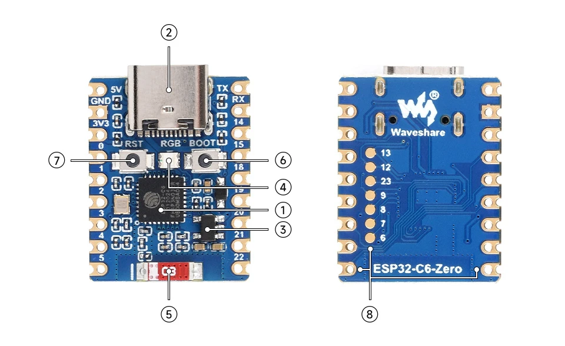
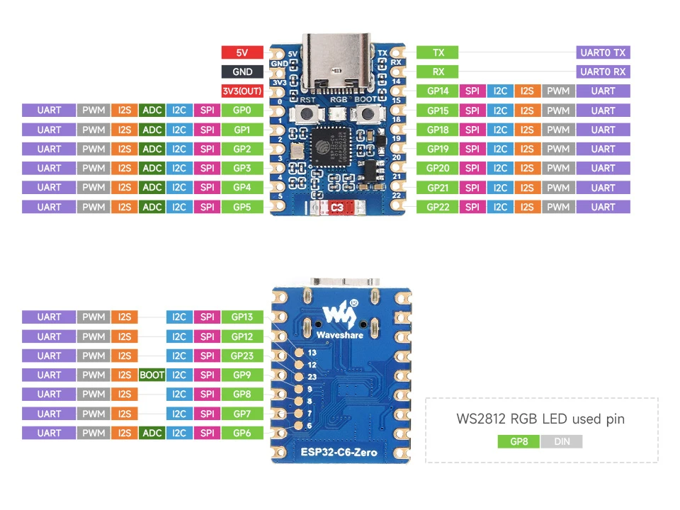
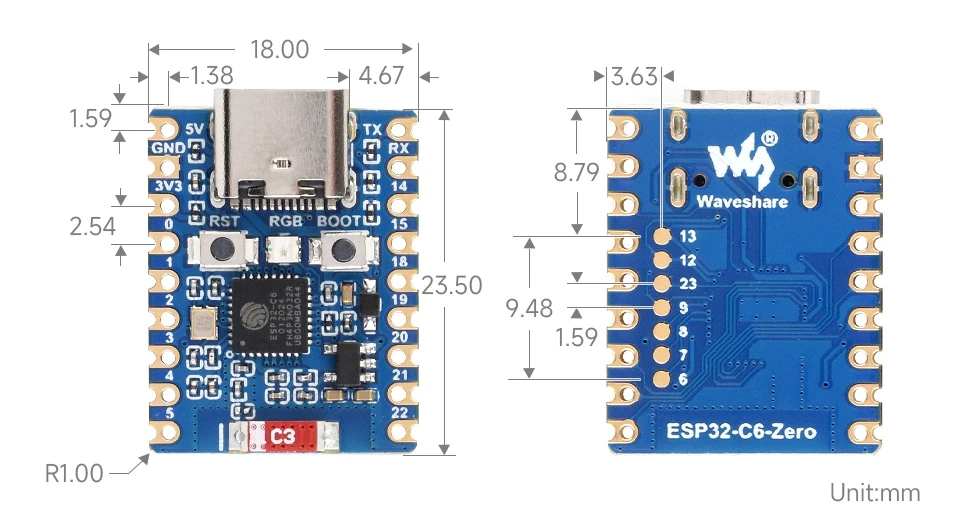

# Waveshare ESP32-C6-Zero

Das ESP-Board für die Power-Trägerplatine (siehe `POWERBOARD-HANDOFF.md`). Gesteckt auf zwei Buchsenleisten 1×9, tauschbar.

## Bestellung

- **OpenELAB:** https://openelab.de/products/entwicklungsboard-basierend-auf-esp32-c6fh4 (5,45 €, Stand 10/2026). Variante **„ESP32-C6-Zero“ ohne -M** wählen, die Stiftleisten löten die Teilnehmer selbst.
- Alternative: Eckstein, https://eckstein-shop.de/waveshare-esp32-c6-zero-m-mikrocontroller-entwicklungsboard-24ghz-wifi-6-bluetooth-5-26976 (6,95 €, das ist die -M-Variante mit eingelöteten Leisten).
- Nur Originale von Waveshare kaufen. Klone übernehmen oft das Pinout, verbauen aber andere Teile (Diode, LDO). Für die Serie alle Boards auf einmal beim selben Händler bestellen.
- Vorsicht bei Angeboten mit fremden Bildern: Das Pinout mit GP33–48, B+/B− und BOOST-Jumper gehört zum ESP32-S3 Super Mini, nicht zu diesem Board.

Herstellerseiten:
- Wiki: https://www.waveshare.com/wiki/ESP32-C6-Zero
- Schaltplan: https://files.waveshare.com/wiki/ESP32-C6-Zero/ESP32-C6-Zero-Sch.pdf (Kopie: `ESP32-C6-Zero-Sch.pdf`)

## Eckdaten

- Chip **ESP32-C6FH4**: RISC-V, Hauptprozessor bis 160 MHz plus LP-Prozessor 20 MHz, 4 MB Flash, 512 KB HP-SRAM + 16 KB LP-SRAM. WiFi 6 (2,4 GHz), Bluetooth 5 LE, IEEE 802.15.4 (Zigbee/Thread).
- Manche Händler schreiben C6FH8 (8 MB). Für die Firmware egal, `platformio.ini` baut für 4 MB.

1. ESP32-C6FH4
2. USB-C: Flashen, Debuggen, Versorgung und künftig Laden
3. ME6217C33M5G: LDO 3,3 V, max. 800 mA
4. WS2812 RGB-LED an GPIO8
5. 2,4-GHz-Keramikantenne, am Ende gegenüber USB-C. Auf der Trägerplatine dort kein Kupfer.
6. BOOT-Taste (GPIO9): gedrückt halten, RESET drücken → Download-Modus
7. RESET-Taste
8. Zusätzliche GPIO-Pads auf der Unterseite

## Stromversorgung (laut Schaltplan)

- USB-VBUS → **B5819WS** (Schottky, 1 A) → 5V-Pin → ME6217C33 → 3V3-Pin.
- Die Diode verhindert, dass eine Speisung am 5V-Pin auf USB zurückfließt.
- **Kein Lader, kein BAT-Pad, keine Power-LED.**

## Pinout

Draufsicht, USB-C oben:

| Pin | Links | Rechts |
|---|---|---|
| 1 | 5V | TX (GPIO16) |
| 2 | GND | RX (GPIO17) |
| 3 | 3V3 (Ausgang) | GPIO14 |
| 4 | GPIO0 | GPIO15 (Strapping) |
| 5 | GPIO1 | GPIO18 |
| 6 | GPIO2 | GPIO19 |
| 7 | GPIO3 | GPIO20 |
| 8 | GPIO4 | GPIO21 |
| 9 | GPIO5 | GPIO22 |

Unterseite, eine Reihe von oben nach unten: GPIO13, 12, 23, 9, 8, 7, 6. GPIO12/13 = USB D−/D+, 8 = WS2812, 9 = BOOT. Diese Pads sind nicht im 2,54-mm-Raster (s. u.) und werden auf der Trägerplatine nicht genutzt.

Belegung auf der Trägerplatine: siehe `POWERBOARD-HANDOFF.md`, Abschnitt 4.

## Abmessungen

Aus der Waveshare-Zeichnung (mm):

- Board 18,00 × 23,50, Eckenradius 1,00.
- 9 Pins pro Seite im Raster 2,54. Erster Pin 1,59 von der Oberkante (1,59 + 8 × 2,54 + 1,59 = 23,50).
- Reihenabstand **15,24 mm (6 × 2,54)** laut Waveshare-DXF. Die Bohrungen sitzen 1,38 mm innerhalb der Board-Kante ((18,00 − 15,24) / 2); die Pads reichen bis an die Kante.
- USB-C-Buchse: Maße 1,38 und 4,67 in der Zeichnung, steht oben leicht über die Kante. Lage am echten Board nachmessen.
- Pads auf der Unterseite: 3,63 von der linken Kante, Raster 1,60, letztes Pad (GPIO6) 5,15 von der Unterkante.
